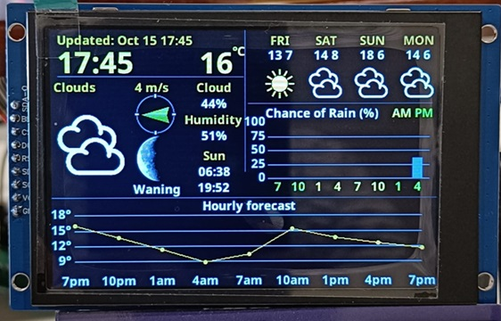

# ESP32 & 3.5 Inch TFT WeatherStation

Hardware:
- ESP32-S3 Wroom1
- Display - 3.5 TFT with S7796S driver 480x320 (Landscape) - Approx $7 USD from Aliexpress



# ESP32 Weather Station with OpenUV Integration

A feature-rich weather station for ESP32 with a 3.5" TFT display (320x480 landscape), showing real-time weather data, forecasts, UV index, and astronomical information.


## Features

### Current Weather Display
- **Real-time conditions**: Temperature, weather description, and condition icon
- **Large, easy-to-read display**: 36pt temperature reading with weather icons
- **Auto-refresh**: Updates every 15 minutes (configurable)

### UV Index Monitoring
- **Real-time UV index**: Current UV levels from OpenUV API
- **Daily maximum UV**: Peak UV forecast with time
- **Color-coded warnings**: Visual indication of UV risk levels (Low, Moderate, High, Very High, Extreme)
- **Independent updates**: UV data refreshes every 30 minutes

### 4-Day Forecast
- **Extended forecast**: Next 4 days with high/low temperatures
- **Weather icons**: Visual representation of expected conditions
- **Day-of-week labels**: Easy-to-read forecast timeline

### Astronomical Data
- **Sunrise/Sunset times**: Daily solar schedule
- **Moon phase**: Visual moon phase indicator with description
- **Wind speed & direction**: Real-time wind data with directional icon
- **Cloud cover**: Percentage cloudiness
- **Humidity**: Relative humidity percentage

### Graphical Displays
- **3-hourly temperature graph**: 9-hour temperature trend with AM/PM indicators
- **Rainfall probability**: 8-hour precipitation chance bar graph
- **Visual data**: Easy-to-understand charts and graphs

### Smart Display Management
- **Selective updates**: Only redraws changed sections to minimize flicker
- **Change detection**: Intelligent comparison prevents unnecessary screen updates
- **Layout verification**: Built-in overlap detection for display integrity
- **Optimized rendering**: Efficient memory usage with cached calculations

## Hardware Requirements

### Core Components
- **ESP32 Development Board** (with PSRAM recommended)
  - ESP32-WROOM-32 or ESP32-WROVER (WROVER has built-in PSRAM)
  - Minimum 4MB flash memory
- **3.5" TFT LCD Display** (320x480 resolution)
  - ILI9488 or compatible driver
  - SPI interface
  - Touch capability (optional, not currently used)
- **Power Supply**: USB or 5V power adapter (ensure stable power)
- **Micro-USB Cable** (for programming and power)

### Display Specifications
- **Resolution**: 320x480 pixels
- **Orientation**: Landscape mode (set via `tft.setRotation(1)`)
- **Interface**: SPI
- **Backlight**: PWM-controlled (configurable brightness 0-255)
- **Colors**: 16-bit RGB565 color depth

### Memory Requirements
- **LittleFS**: Minimum 1.5MB for fonts, icons, and images
- **PSRAM**: Recommended for smooth operation (4MB or 8MB)
- **Flash**: ESP32 with at least 4MB flash memory
- **RAM**: ~100KB for weather data structures and display buffers

### Recommended ESP32 Boards
- **ESP32-DevKitC** - Good general purpose board
- **ESP32-WROVER-KIT** - Includes PSRAM, ideal for this project
- **ESP32-DevKit v1** - Budget-friendly option
- **TTGO T-Display** - Compact with built-in display (requires adaptation)

## Pin Configuration

The TFT display pins are configured in the `User_Config.h` file inside the TFT_eSPI library. Common pin configurations:

### Typical ESP32 SPI Pins
```cpp
TFT_MISO  19
TFT_MOSI  23
TFT_SCLK  18
TFT_CS    15
TFT_DC    2
TFT_RST   4
TFT_BL    32  // Backlight PWM (configurable in All_Settings.h)
```

**Note**: Pin assignments may vary depending on your specific ESP32 board and TFT display. Always verify with your hardware documentation.

### Wiring Diagram Considerations
- Keep SPI wires as short as possible to avoid signal degradation
- Use a common ground between ESP32 and display
- If display has separate VCC and LED pins, connect both to appropriate voltage
- Some displays require 3.3V logic, others are 5V tolerant - check specifications

## Software Dependencies

### Required Arduino Libraries
Install via Arduino Library Manager (Sketch → Include Library → Manage Libraries):

1. **TFT_eSPI** (by Bodmer) - v2.4.0 or later
   - Display driver library
   - Requires manual configuration of `User_Setup.h`

2. **OpenWeather** (by Bodmer) - v1.1.0 or later
   - Weather data parsing
   - Install from: https://github.com/Bodmer/OpenWeather

3. **ArduinoJson** (by Benoit Blanchon) - v6.x
   - JSON parsing for API responses
   - Version 6.x required (not v7)

4. **Time** (by Michael Margolis) - v1.6.1 or later
   - Time handling and timezone support

5. **Timezone** (by Jack Christensen) - v1.2.4 or later
   - Timezone conversions

### ESP32 Board Support
- **Arduino-ESP32** - v2.0.0 or later
- Install via Boards Manager: `https://raw.githubusercontent.com/espressif/arduino-esp32/gh-pages/package_esp32_index.json`
- Provides LittleFS support (required for v2.0.0+)

### Additional Tools
- **Arduino IDE** - v2.0+ recommended (or v1.8.19+)
- **LittleFS Upload Plugin** - For uploading data files
- **USB Drivers** - CP210x or CH340 drivers (depending on your ESP32 board)

## Configuration Guide

### 1. Initial Setup

#### Install Arduino IDE & ESP32 Support
1. Download Arduino IDE 2.x from https://www.arduino.cc/en/software
2. Open Arduino IDE → File → Preferences
3. Add ESP32 board URL to "Additional Boards Manager URLs":
   ```
   https://raw.githubusercontent.com/espressif/arduino-esp32/gh-pages/package_esp32_index.json
   ```
4. Go to Tools → Board → Boards Manager
5. Search for "ESP32" and install "esp32 by Espressif Systems" (v2.0.0 or later)

#### Install Required Libraries
Install these libraries through the Arduino Library Manager:
- `TFT_eSPI` by Bodmer
- `OpenWeather` by Bodmer (https://github.com/Bodmer/OpenWeather)
- `ArduinoJson` by Benoit Blanchon
- `Time` library

#### Configure TFT_eSPI Library
1. Navigate to `Arduino/libraries/TFT_eSPI/`
2. Edit `User_Setup.h` to match your display driver and pins
3. Ensure your display driver is uncommented (e.g., `#define ILI9488_DRIVER`)

### 2. Edit All_Settings.h

#### WiFi Configuration
```cpp
#define WIFI_SSID      "YourNetworkName"
#define WIFI_PASSWORD  "YourPassword"
```

#### Timezone
```cpp
#define TIMEZONE NZ  // Options: UK, usMT, NZ, etc.
```
See `NTP_Time.h` for available timezone references.

#### Location Settings
Set your coordinates to at least 4 decimal places:
```cpp
const String latitude =  "-43.5321";  // 90.0000 to -90.0000 (negative = South)
const String longitude = "172.6362";  // 180.000 to -180.000 (negative = West)
```

**How to find your coordinates:**
- Use Google Maps: Right-click location → Click coordinates to copy
- Use GPS coordinates from your phone
- Format: Decimal degrees (not degrees/minutes/seconds)

#### API Keys

**OpenWeatherMap API** (Required)
1. Sign up at https://openweathermap.org/
2. Generate a free API key
3. Replace in `All_Settings.h`:
```cpp
const String api_key = "your_api_key_here";
```

**OpenUV API** (Required for UV data)
1. Sign up at https://www.openuv.io/
2. Get your API key
3. Replace in `All_Settings.h`:
```cpp
const String OPENUV_API_KEY = "your_openuv_key_here";
```

#### Units & Language
```cpp
const String units = "metric";     // or "imperial"
const String language = "en";      // Language code (en, es, fr, de, etc.)
```

#### Update Intervals
```cpp
const int UPDATE_INTERVAL_SECS = 15UL * 60UL;     // Weather: 15 minutes
const uint32_t UV_UPDATE_INTERVAL_SECS = 30UL * 60UL;  // UV: 30 minutes
```

#### Display Settings
```cpp
const uint8_t BACKLIGHT = 100;     // 0-255 (brightness)
const bool USE_24H = true;         // 24-hour time format
```

### 3. Upload Filesystem Data

#### Install LittleFS Upload Plugin
1. Download from: https://github.com/earlephilhower/arduino-littlefs-upload
2. Place in: `C:\Users\[YourUsername]\.arduinoIDE\plugins\`
3. Create the `plugins` folder if it doesn't exist
4. Restart Arduino IDE

#### Upload Files
1. **IMPORTANT**: Before uploading, set LittleFS to at least **1.5MB** in Arduino IDE:
   - `Tools` → `Partition Scheme` → Select option with >= 1.5MB LittleFS
   - Recommended: "Default 4MB with spiffs (1.2MB APP/1.5MB SPIFFS)" or similar
2. Press `Ctrl+Shift+P` to open command palette
3. Search for "Upload LittleFS to ESP32"
4. Wait for upload to complete (can take 2-5 minutes)

**Files to upload** (in sketch `data` folder):
- `/fonts/` - Font files (NSBold15, NSBold36)
- `/icon/` - Large weather icons (100x100px BMP files)
- `/icon50/` - Small forecast icons (50x50px BMP files)
- `/wind/` - Wind direction icons (N, NE, E, SE, S, SW, W, NW)
- `/moon/` - Moon phase icons (moonphase_L0 through L7)
- `/splash/` - Startup splash image (OpenWeather.jpg)

**Note**: All icon files must be in BMP format. JPG is only used for the splash screen.

### 4. Upload Sketch
1. Select your ESP32 board in `Tools` → `Board` → `ESP32 Arduino` → Your specific board
2. Select correct COM port in `Tools` → `Port`
3. Set upload speed: `Tools` → `Upload Speed` → `921600` (or `115200` if issues occur)
4. Set Flash Frequency: `Tools` → `Flash Frequency` → `80MHz`
5. Click Upload button or press `Ctrl+U`
6. Wait for compilation and upload (may take 1-2 minutes)
7. Monitor serial output (`Tools` → `Serial Monitor`, set to **250000 baud**)

**Important Upload Settings:**
- **Board**: ESP32 Dev Module (or your specific board)
- **Upload Speed**: 921600 (reduce to 115200 if upload fails)
- **CPU Frequency**: 240MHz (default)
- **Flash Frequency**: 80MHz
- **Flash Mode**: QIO
- **Flash Size**: 4MB (or your board's actual flash size)
- **Partition Scheme**: Default 4MB with spiffs (1.2MB APP/1.5MB SPIFFS)

### 5. First Run
On first boot, the display will show:
1. OpenWeather splash screen
2. "Connecting to WiFi" message
3. "Fetching weather data..." message
4. Full weather display appears

**Troubleshooting:**
- If stuck on "Connecting to WiFi", verify credentials
- If "FS Mount FAILED", re-upload LittleFS data
- Check serial monitor for detailed error messages

## API Rate Limits

### OpenWeatherMap
- **Free tier**: 1,000 calls/day (~42/hour)
- **Default update**: Every 15 minutes (~96/day)
- **Current usage**: Well within free limits
- **Upgrade options**: Paid plans available for more frequent updates

### OpenUV
- **Free tier**: 50 calls/day
- **Default update**: Every 30 minutes (~48/day)
- **Current usage**: Within free limits
- **Note**: UV data only available during daylight hours at your location

### Best Practices
- Don't reduce update intervals below 10 minutes to respect API limits
- Monitor your API usage on provider dashboards
- Free API keys may have temporary rate limiting during high traffic

## Serial Monitor Output

The project provides detailed debug information via serial at **250000 baud**. Expected messages include:

**Successful Boot:**
```
✓ PSRAM initialized.
Display: 480x320
✓ Layout verification passed
Initializing LittleFS... SUCCESS.
✓ Setup complete. Starting loop...
Connecting to WiFi......
✓ Weather data received
✓ Static elements drawn
✓ Current weather updated
✓ UV index drawn
```

**During Operation:**
```
Updating UV data...
UV Data: Current=5.2, Max=8.3 (at 13:00 local)
✓ UV index updated
✓ Forecast updated
```

**Useful for Debugging:**
- Connection status and WiFi signal strength
- API response codes
- JSON parsing errors
- Layout dimension calculations
- Data update confirmations

## Customization Options

### Display Language
Modify these arrays in `All_Settings.h`:
```cpp
const String shortDOW[8] = { "???", "SUN", "MON", "TUE", "WED", "THU", "FRI", "SAT" };
const char sunStr[] = "Sun";
const char cloudStr[] = "Cloud";
const char humidityStr[] = "Humidity";
const String moonPhase[8] = { "New", "Waxing", "1st qtr", ... };
```

### Colors
Main colors used (modify in code):
- `TFT_YELLOW` - Temperature, time
- `TFT_ORANGE` - Labels, update text
- `TFT_WHITE` - Data values
- `TFT_LIGHTGREY` - Secondary text
- `TFT_BLUE` - Rain probability bars

### Layout
Display dimensions are automatically calculated based on screen size. Key constants:
```cpp
static const uint16_t ICON_SIZE_LARGE = 100;
static const uint16_t ICON_SIZE_SMALL = 64;
static const uint16_t UV_DISPLAY_HEIGHT = 30;
```

## Upcoming Features

🚀 **Planned Enhancements:**

- [ ] **Web Interface Configuration**
  - Configure all parameters via web browser
  - Change location, API keys, and settings without recompiling
  - Real-time preview of changes
  
- [ ] **Dark & Light Themes**
  - Switchable color schemes for web interface
  - Automatic theme based on time of day
  - Custom color palette support

- [ ] **Auto Hotspot Mode**
  - Automatic WiFi access point when connection fails
  - Configure WiFi credentials through hotspot
  - Graceful fallback and recovery

- [ ] **Over-The-Air (OTA) Updates**
  - Update firmware wirelessly
  - No need to physically connect for updates
  - Version checking and automatic notifications

## Troubleshooting

### Common Issues

**Display shows nothing:**
- Check TFT_eSPI pin configuration
- Verify backlight pin and brightness setting
- Check power supply (ESP32 needs stable 5V/3.3V)

**"FS Mount FAILED":**
- Re-upload LittleFS data files
- Ensure partition scheme has >= 1.5MB for LittleFS
- Verify all required folders exist in `data` folder

**Weather data not updating:**
- Check WiFi credentials
- Verify API keys are valid
- Check serial monitor for HTTP error codes
- Ensure location coordinates are correct

**UV data shows "N/A":**
- Verify OpenUV API key is correct
- Check API rate limits haven't been exceeded
- Ensure location coordinates are accurate

**Display flickers:**
- Normal during data updates
- Excessive flickering may indicate memory issues
- Try enabling PSRAM if available

**Compilation errors:**
- Ensure all required libraries are installed
- Check library versions (ArduinoJson v6.x, not v7)
- Verify ESP32 board support package is v2.0.0+

**Upload fails:**
- Try reducing upload speed to 115200
- Press and hold BOOT button during upload
- Check USB cable (must support data, not just power)
- Verify correct COM port is selected

**Time shows incorrect timezone:**
- Check TIMEZONE setting in All_Settings.h
- Verify NTP_Time.h has your timezone defined
- Ensure WiFi is connected (NTP requires internet)

**Icons or fonts not displaying:**
- Verify LittleFS was uploaded successfully
- Check partition scheme has adequate LittleFS space
- Ensure all required folders exist in data directory
- File names are case-sensitive on LittleFS

**Memory errors or crashes:**
- Enable PSRAM if your board supports it
- Reduce image sizes or icon count
- Check for memory leaks in serial monitor
- Verify adequate flash partition for program

## Performance Optimization

### Tips for Smooth Operation
1. **Use PSRAM-equipped ESP32** (WROVER modules) for best performance
2. **Minimize serial debug output** - Comment out `#define SERIAL_MESSAGES` for production
3. **Optimize update intervals** - Balance between freshness and API limits
4. **Keep WiFi signal strong** - Weak signal causes delays and timeouts
5. **Use quality power supply** - Unstable power causes crashes and display issues

### Memory Usage
- **Program size**: ~1.2MB compiled code
- **LittleFS data**: ~1.5MB (fonts, icons, images)
- **Runtime RAM**: ~100KB for buffers and data structures
- **PSRAM usage**: Dynamic allocation for large images

## Project Structure

```
ESP32_Weather_Station/
├── ESP32_3_5_Weather_Station_Landscape_v39_Pro.ino  # Main sketch
├── All_Settings.h                                    # Configuration file
├── NTP_Time.h                                        # Time/timezone handling
├── GfxUi.h / GfxUi.cpp                              # UI helper functions
├── data/                                             # LittleFS filesystem
│   ├── fonts/
│   │   ├── NSBold15                                 # Small text font
│   │   └── NSBold36                                 # Large number font
│   ├── icon/                                        # 100x100 weather icons
│   ├── icon50/                                      # 50x50 forecast icons
│   ├── wind/                                        # Wind direction icons
│   ├── moon/                                        # Moon phase icons
│   └── splash/
│       └── OpenWeather.jpg                          # Startup image
└── README.md                                         # This file
```

## Display Layout

```
┌─────────────────────┬──────────────────────┐
│  Time & Date        │  4-Day Forecast      │
│  Current Temp (36pt)│  (with icons)        │
├─────────────────────┤                      │
│  Current Weather    │                      │
│  Description        ├──────────────────────┤
│  (with large icon)  │  Rainfall Graph      │
│                     │  (8-hour PoP)        │
├─────────────────────┤                      │
│  Wind  │ Cloud      │                      │
│  Speed │ Cover      │                      │
│        │            │                      │
│  Moon  │ Humidity   │                      │
│  Phase │            │                      │
│        │ Sun Times  │                      │
├─────────────────────┴──────────────────────┤
│  3-Hour Temperature Graph (9 hours)        │
│  with UV Index display                     │
└────────────────────────────────────────────┘
```

## Credits

- **Original concept**: blog.squix.org
- **ESP32 adaptation**: Bodmer
- **OpenWeather library**: https://github.com/Bodmer/OpenWeather
- **TFT_eSPI library**: https://github.com/Bodmer/TFT_eSPI
- **UV integration**: Custom implementation with OpenUV API

## License

This project is open source. Please respect the licenses of included libraries:
- TFT_eSPI: FreeBSD License
- OpenWeather: MIT License
- ArduinoJson: MIT License

## Contributing

Contributions are welcome! Please feel free to submit pull requests or open issues for bugs and feature requests.

### How to Contribute
1. Fork the repository
2. Create a feature branch (`git checkout -b feature/AmazingFeature`)
3. Commit your changes (`git commit -m 'Add some AmazingFeature'`)
4. Push to the branch (`git push origin feature/AmazingFeature`)
5. Open a Pull Request

### Development Guidelines
- Follow existing code style and formatting
- Test on actual hardware before submitting
- Update documentation for new features
- Add comments for complex logic
- Verify no memory leaks or crashes

### Areas for Contribution
- Additional weather providers
- New display layouts or themes
- Touch screen integration
- Multi-language support
- Additional sensors (BME280, etc.)
- Power management features

## Frequently Asked Questions

**Q: Can I use a different size display?**
A: Yes, but you'll need to adjust layout calculations. The code uses proportional sizing, so a 2.8" or 4" display should work with minimal changes.

**Q: Does this work with other ESP32 variants (S2, S3, C3)?**
A: The code is designed for ESP32 classic. ESP32-S2/S3 should work with pin adjustments. ESP32-C3 may require more modifications.

**Q: Can I add more cities or multiple location support?**
A: Currently supports single location. Multi-location support is on the roadmap for web interface update.

**Q: How much power does it consume?**
A: Approximately 150-300mA depending on backlight brightness and WiFi activity. Use a quality 5V/1A+ power supply.

**Q: Can I use this outdoors?**
A: The display is not weatherproof. For outdoor use, you'll need an appropriate enclosure with ventilation and UV-resistant screen cover.

**Q: Does it work offline after initial setup?**
A: No, it requires continuous WiFi for weather updates and time synchronization. Offline mode is planned for future releases.

**Q: Can I customize the weather icons?**
A: Yes! Replace the BMP files in `/data/icon/` with your own. Keep the same filenames and dimensions (100x100 for large icons).

**Q: Why does UV data show "N/A" at night?**
A: UV data is only available during daylight hours at your location. This is normal and expected.

## Version History

### v39 Pro (Current)
- ✓ Added OpenUV integration for real-time UV index
- ✓ Separate UV update timer (30 minutes)
- ✓ Fixed duplicate function definitions
- ✓ Improved layout management and overlap detection
- ✓ Enhanced change detection for selective updates
- ✓ Added comprehensive serial debug output
- ✓ Memory optimization with cached calculations

### Known Issues
- Touch screen support not implemented
- No battery/power monitoring
- Single location only
- Requires constant WiFi connection

### Future Versions
See "Upcoming Features" section above for planned enhancements.

## Support

For issues and questions:
1. Check the troubleshooting section above
2. Review serial monitor output for error messages
3. Open an issue on GitHub with:
   - Hardware details (ESP32 model, display type)
   - Serial monitor output
   - Steps to reproduce the problem

---

**Enjoy your weather station! ☀️🌧️❄️**
````
